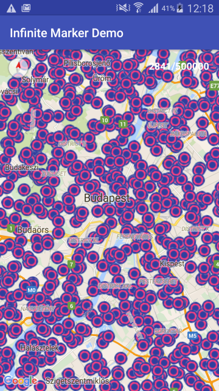
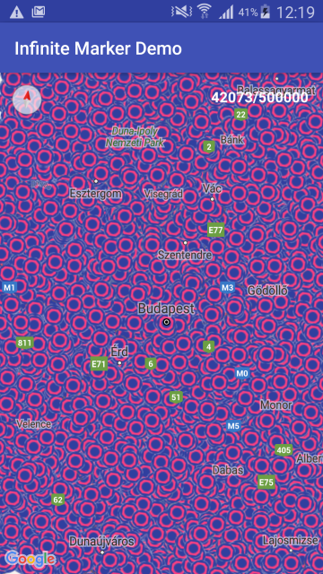
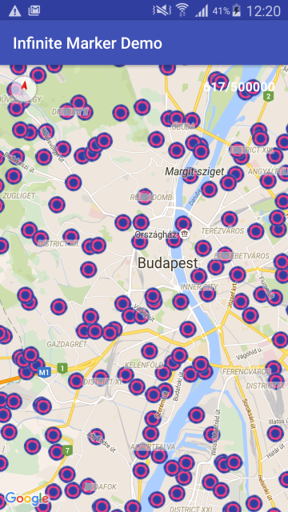

# How to Render More Than a Lot of Markers on Google Maps for Android

## Preview

    

## Usage

In MapFragemnt:

  ```java
private HugeMapUtil hugeMapUtil;

@Override
public void onMapReady(GoogleMap googleMap) {
    try {
        hugeMapUtil = new HugeMapUtil.Builder(getActivity())
                .setOverlayCalculationCallback(this)
                .setMap(googleMap)
                .build();
    } catch (Exception e) {
        e.printStackTrace();
    }
    getMarkerPositions();
}

private void onReceivedMarkerPositions(List<LatLngWrapper> latLngWrappers){
	if (hugeMapUtil != null) {
        hugeMapUtil.setLatLngWrappers(latLngWrappers);
    }
}
  ```

And you have to register a Google Maps Key on your Google Dev Console and paste it into the strings.xml
  ```xml
	<string name="google_maps_key" templateMergeStrategy="preserve" translatable="false">
        >>PASTE_YOUR_GOOGLE_MAPS_KEY_HERE
    </string>
  ```	

The purpose of the article is to demonstrate a method on how to extend the capabilities of the Google Maps API on Android devices. Basically, Google Maps can render only a limited number of markers over the map, let’s say a few thousand, but with larger numbers it will start to lag and will ruin the user experience. The method demonstrated below will allow android projects to render a few tens to a hundred thousand markers (with limitations on the marker variety).

## More Than a Lot of Markers on Google Maps for Android

Source: https://developers.google.com/maps/articles/toomanymarkers#viewportmarkermanagement
## The first approach – Ground Overlay with Bitmaps:

The first idea was to create a bitmap which covers the visible area of the map and draw the markers on it using the Canvas class. To avoid OutOfMemory errors, the size of bitmaps are limited. So rendering only a small piece of the map is possible at a given time. We used the Location class for distance measurements and Observables for easier thread handling of parallel tasks. This version worked well for a hundred thousand markers with the calculation time of less than one second. After some examination and tests, we noticed that the threads are spending most of their time with distance calculations, so we searched for an optimized algoritm for this estimate.

## Distance estimation

After a few hours of research we found that the Haversine formula will give a really good estimate of the distance. The Haversine calculation proved to be SO MUCH FASTER than the SDK’s Location implementation.

### The simplified Haversine implementation:

  ```java
public class PositionUtils {
    public static float calculateHaversineDistance(double lat1, double lon1, double lat2, double lon2) {
        final double p = 0.017453292519943295;      // Math.PI / 180
        final double earthRad2 = 12742000f;         // 2 * R; R = 6371 km
        final double lat1p = lat1 * p;
        final double lat2p = lat2 * p;
        double a = 0.5 - Math.cos(lat2p - lat1p) / 2 +
                Math.cos(lat1p) * Math.cos(lat2p) *
                        (1 - Math.cos((lon2 - lon1) * p)) / 2;
        return (float) (earthRad2 * Math.asin(Math.sqrt(a)));
    }
}
  ```
 

The next problematic part was the Canvas drawing. We ran a few tests and realized: if we have enough markers, drawing two or more bitmaps in parallel and merging them at the end is best. But this, of course, brings the memory issues back. All in all, the whole bitmap approach is prone to memory leaking and OutOfMemory problems.

## Drawing fast – OpenGL ES 2.0

For speeding up the drawing, we saw that parallel processing is the best way to go. So the next approach uses the GPU and Open GL ES. The current implementation is somewhat of a hybrid, it doesn’t use a SurfaceView to show the markers, instead it renders the markers with the OpenGL API and reads the pixels out and converts them to a bitmap. Finally, it overlays the resulting bitmap the same way the previous approach did.

Credits: http://www.anddev.org/android-2d-3d-graphics-opengl-tutorials-f2/possible-to-do-opengl-off-screen-rendering-in-android-t13232.html#p41662

## Future improvements

 - Implementing the Haversine algoritm into the OpenGL shader kernel or RenderScript
 - Avoiding the resulting bitmap and using a SurfaceView overlay above the MapView
 - Cache pre-calculated distances
 - Make markers customizable

 
## License
This software is licensed under the Apache 2 license, quoted below.

Copyright 2016 Wanari, Inc.

Licensed under the Apache License, Version 2.0 (the "License"); you may not
use this file except in compliance with the License. You may obtain a copy of
the License at

    http://www.apache.org/licenses/LICENSE-2.0

Unless required by applicable law or agreed to in writing, software
distributed under the License is distributed on an "AS IS" BASIS, WITHOUT
WARRANTIES OR CONDITIONS OF ANY KIND, either express or implied. See the
License for the specific language governing permissions and limitations under
the License.